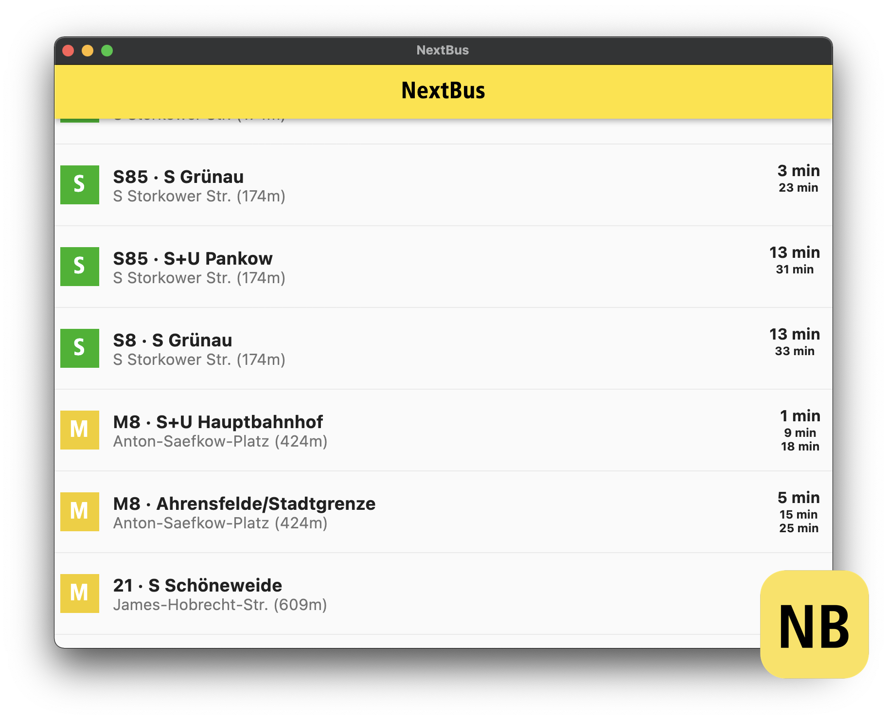

# NextBus - One Glance Transit Lookup for Berlin

- Also builds on windows, Web (Chrome), macOS.

If you want to know when is the next transit departures near you in Berlin 🇩🇪 with one single glance this app is for you.

- Supports 🚍Bus, Train 🚆 (S-Bahn, U-Bahn, Regional Trains, ICE), 🚊Tram, and ⛴️Ferry anywhere in Berlin.
- Sorted by the stops nearest to you making it perfect for people who want to avoid long walks or want to take routes with less waiting time.
- Uses BVG API as described in https://github.com/derhuerst/bvg-rest/blob/2/docs/index.md
- Uses Flutter to build both iOS and Android app.

## Build Process

- Read Flutter documentation on how to install Flutter and configure your IDE - https://flutter.dev/docs/get-started/
- Clone the repository.
- Run `flutter pub get` to install packages used in the projects.
- Open Android studio and run on any simulator or device (including macOS and Chorme)

| iOS App                                                    | Android App                                                        |
| ---------------------------------------------------------- | ------------------------------------------------------------------ |
|  |  |

| macOS App                                                        |
| ---------------------------------------------------------------- |
|  |

## Future Improvements

- Ability to save locations to access easily (see design files).
- Ability to pin a transit route as favorite so it shows up on top of the list if it's one of the departure options.
- Multiple language support (starting with German).
- Basic tests for the UI, API, and models.
